# Нелинейные фильтры Калмана и их гибриды // Nonlinear Kalman filters and their hybrids #

***
## Перечень фильтров // List of filters ##

1)  ЛФК - Линейный Фильтр Калмана (LKF - Linear Kalman Filter);  
2)  РФК - Расширенный Фильтр Калмана (EKF - Extended Kalman Filter);  
3)  ККРФК - Квадратно-Корневой Расширенный Фильтр Калмана (SREKF - Square Root Extended Kalman Filter);  
4)  СТФК - Сигма-точечный (ансцентный) Фильтр Калмана (UKF - Unscented Kalman Filter);  
5)  КК-СТФК - Квадратно-Корневой Сигма-точечный Фильтр Калмана (SRUKF - Square Root Unscented Kalman Filter);  
6)  КК-СТФКБ - Блочная реализация КК-СТФК (SRUKFB - Square Root Unscented Kalman Filter Block);  
7)  КФК - Кубатурный Фильтр Калмана (СKF - Cubature Kalman Filter);  
8)  КК-КФК - Квадратно-Корневой Кубатурный Фильтр Калмана (SRCKF - Square Root Cubature Kalman Filter);  
9)  КК-КФКБ - Блочная реализация КК-КФК (SRCKFB - Square Root Cubature Kalman Filter Block);  
10) РСТФК - Расширенно-Сигма-точечный Фильтр Калмана (EUKF - Extended Unscented Kalman Filter);  
11) КК-РСТФК - Квадратно-Корневой Расширенно-Сигма-точечный Фильтр Калмана (SREUKF - Square Root Extended Unscented Kalman Filter);  
12) КК-РСТФКБ - Блочная реализация КК-РСТФК (SREUKFB - Square Root Extended Unscented Kalman Filter Block);  
13) РКФК - Расширенно-Кубатурный Фильтр Калмана (EСKF - Extended Cubature Kalman Filter);  
14) КК-РКФК - Квадратно-Корневой Расширенно-Кубатурный Фильтр Калмана (SREСKF - Square Root Extended Cubature Kalman Filter);  
15) КК-РКФКБ - Блочная реализация КК-РКФК (SREСKFB - Square Root Extended Cubature Kalman Filter Block).  

***
## Выбранная система координат // Choosed coordinate system ##

X = { X, Y, V, K, dK/dt }, Y = { R, Az, Vr },

вектор состояния // state vector:
* X, Y - 2-D декартовы кооринаты, км // 2-D decart coordinates, km;
* V - полная скорость, м/с // velocity, m/s;
* K - курс, градусы // course, degrees;
* dK/dt - скорость изменения курса, градусы/с // course change rate, degrees/s;

вектор измерений // measurement vector:
* R - дальность, км // range, km;
* Az - азимут, градусы // azimuth, degrees;
* Vr - радиальная скорость, м/с // radial velocity, m/s;

Начальное состояние // Start state: 
* X = 100 км // km;
* Y = 100 км // km;
* V = 200 м/с // m/s;
* K = 65 градусов // degrees;
* dK/dt = 1.0e-6 градус/с // degrees/s;

СКО измерений / Measurements RMS:
* RMS_R = 0.3 км // km;
* RMS_Az = 0.18 градусов // degrees;
* RMS_Vr = 0.3 м/с // m/s;

***
## Результаты подбора парамметров разброса сигма-точек // Results of sigma-points choosing ##

Рис.1 - RMSE вектора состояния при изменении параметра разброса сигма-точек kappa // RMSE of state vector while varying kappa parameters of sigma-points

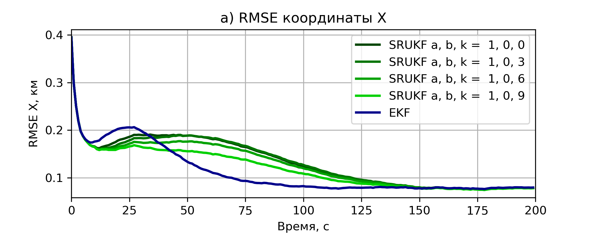

<?\image html RMSE/X.png width=1200px?>
<?\image latex RMSE/X.png?>

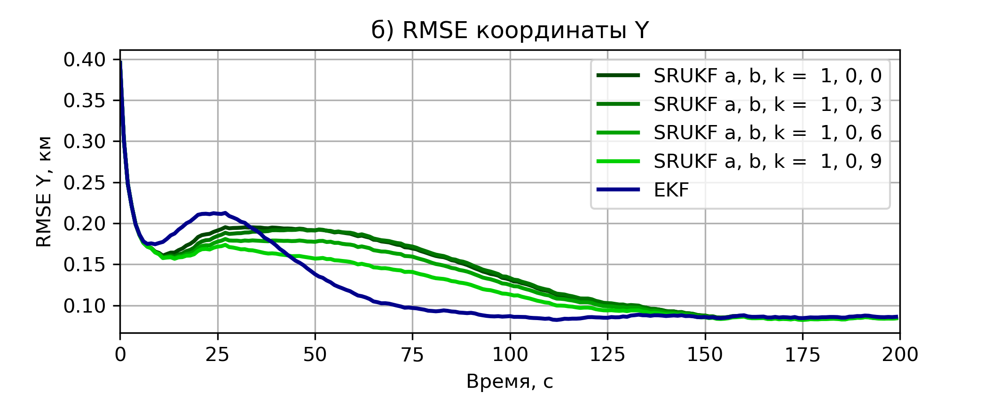

<?\image html RMSE/Y.png width=1200px?>
<?\image latex RMSE/Y.png?>

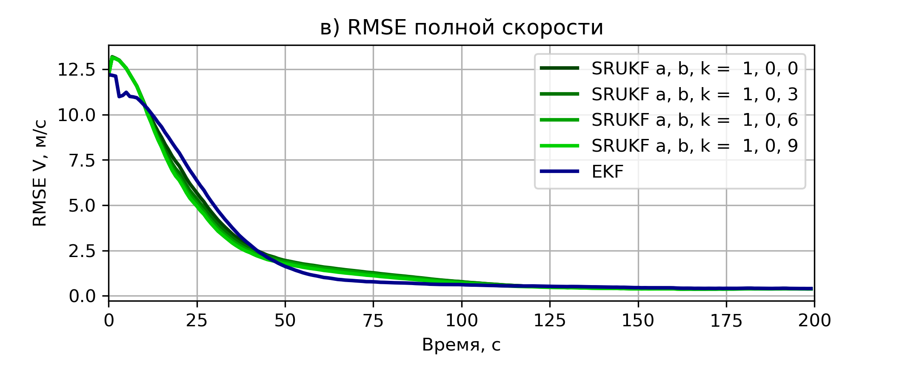

<?\image html RMSE/V.png width=1200px?>
<?\image latex RMSE/V.png?>

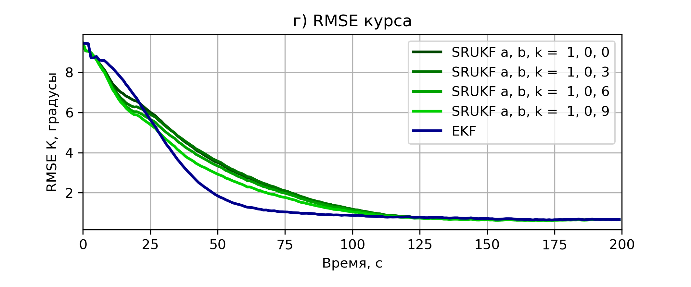

<?\image html RMSE/K.png width=1200px?>
<?\image latex RMSE/K.png?>

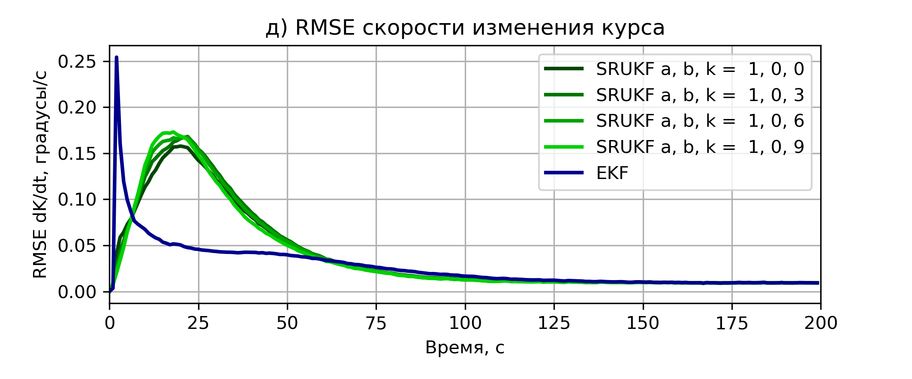

<?\image html RMSE/Ka.png width=1200px?>
<?\image latex RMSE/Ka.png?>

***
## Результаты оценки СКО // RMSE results ##

Рис.2 - RMSE вектора состояния различных фильтров // RMSE of state vector of different filters

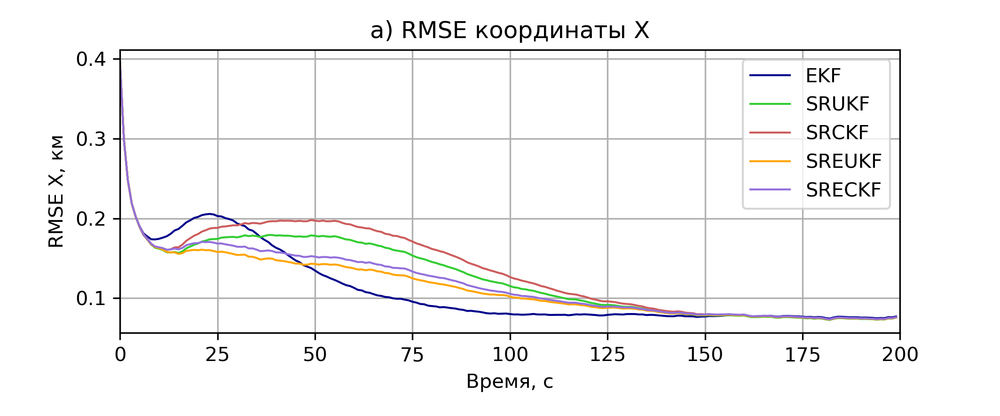

<?\image html RMSE2/X.png width=1200px?>
<?\image latex RMSE2/X.png?>

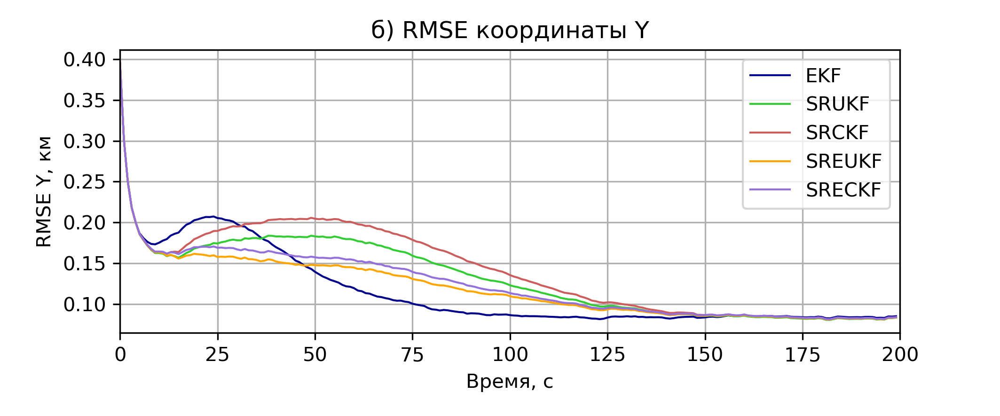

<?\image html RMSE2/Y.png width=1200px?>
<?\image latex RMSE2/Y.png?>

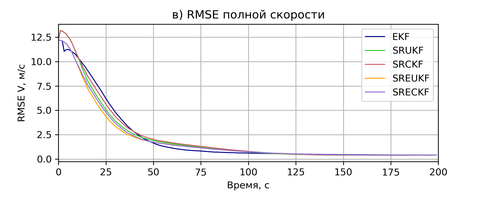

<?\image html RMSE2/V.png width=1200px?>
<?\image latex RMSE2/V.png?>

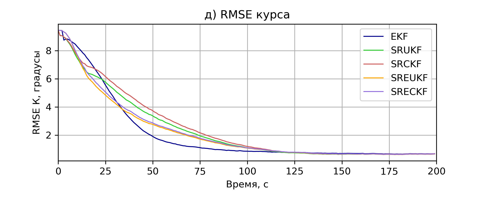

<?\image html RMSE2/K.png width=1200px?>
<?\image latex RMSE2/K.png?>

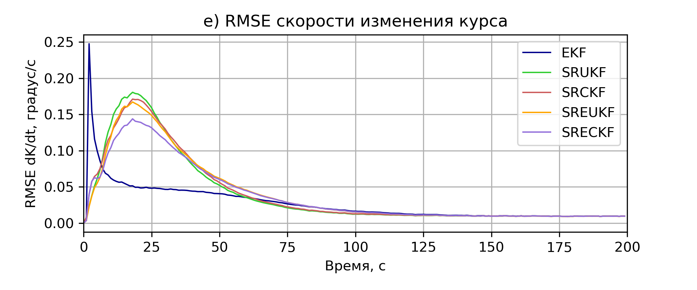

<?\image html RMSE2/Ka.png width=1200px?>
<?\image latex RMSE2/Ka.png?>

***
## Результаты оценки времени выполнения // Time measuring results ##

Рис.4 - Время выполнения относительно РФК // Time of execution relative to EKF

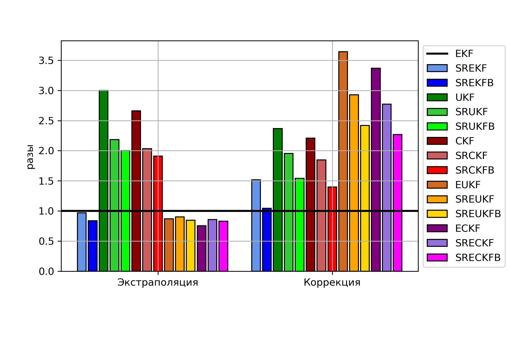

<?\image html TIME/time.png  width=1200px?>
<?\image latex TIME/time.png?> 