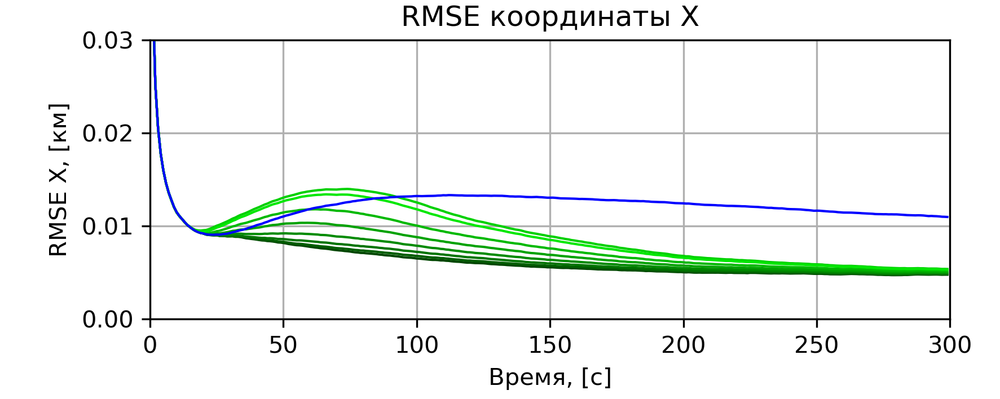

# Результаты моделирования фильтров Калмана #
***

1)  ЛФК - Линейный Фильтр Калмана (LKF - Linear Kalman Filter);  
2)  РФК - Расширенный Фильтр Калмана (EKF - Extended Kalman Filter);  
3)  ККРФК - Квадратно-Корневой Расширенный Фильтр Калмана (SREKF - Square Root Extended Kalman Filter);  
4)  СТФК - Сигма-точечный (ансцентный) Фильтр Калмана (UKF - Unscented Kalman Filter);  
5)  КК-СТФК - Квадратно-Корневой Сигма-точечный Фильтр Калмана (SRUKF - Square Root Unscented Kalman Filter);  
6)  КК-СТФКБ - Блочная реализация КК-СТФК (SRUKFB - Square Root Unscented Kalman Filter Block);  
7)  КФК - Кубатурный Фильтр Калмана (СKF - Cubature Kalman Filter);  
8)  КК-КФК - Квадратно-Корневой Кубатурный Фильтр Калмана (SRCKF - Square Root Cubature Kalman Filter);  
9)  КК-КФКБ - Блочная реализация КК-КФК (SRCKFB - Square Root Cubature Kalman Filter Block);  
10) РСТФК - Расширенно-Сигма-точечный Фильтр Калмана (EUKF - Extended Unscented Kalman Filter);  
11) КК-РСТФК - Квадратно-Корневой Расширенно-Сигма-точечный Фильтр Калмана (SREUKF - Square Root Extended Unscented Kalman Filter);  
12) КК-РСТФКБ - Блочная реализация КК-РСТФК (SREUKFB - Square Root Extended Unscented Kalman Filter Block);  
13) РКФК - Расширенно-Кубатурный Фильтр Калмана (EСKF - Extended Cubature Kalman Filter);  
14) КК-РКФК - Квадратно-Корневой Расширенно-Кубатурный Фильтр Калмана (SREСKF - Square Root Extended Cubature Kalman Filter);  
15) КК-РКФКБ - Блочная реализация КК-РКФК (SREСKFB - Square Root Extended Cubature Kalman Filter Block).  

***
Выбранная система координат:

X = { X, Y, V, K, dK/dt }, Y = { R, Az, Vr },

где пространство состояния:
* X, Y - плоскостные декартовы кооринаты, км;
* V - полная скорость, м/с;
* K - курс, град;
* dK/dt - скорость изменения курса, град/с;

пространство измерений:
* R - дальность, км;
* Az - азимут, град;
* Vr - радиальная скорость, м/с;

ЛФК не может быть применен при выбранной системе координат напрямую, поэтому не приводится далее.

Начальное состояние объекта: 
* X = 100 км;
* Y = 100 км;
* V = 100 м/с;
* K = 45 град;
* dK/dt = 0 град/с;

СКО измерений:
* RMS_R = 0.048 км;
* RMS_Az = 0.008 град;
* RMS_Vr = 0.016 м/с;

***

Рис.1 - RMSE вектора состояния при изменении параметра разброса сигма-точек alpha=1.0...0.35 (от светлого к темному)

<?\image html merwe_good/COMPARE_EKF_SRUKF_Merwe_x__RMSE_X_MCruns_10000__dt_1.000000.png width=1200px?>
<?\image latex merwe_good/COMPARE_EKF_SRUKF_Merwe_x__RMSE_X_MCruns_10000__dt_1.000000.png?>

<?\image html merwe_good/COMPARE_EKF_SRUKF_Merwe_y__RMSE_X_MCruns_10000__dt_1.000000.png width=1200px?>
<?\image latex merwe_good/COMPARE_EKF_SRUKF_Merwe_y__RMSE_X_MCruns_10000__dt_1.000000.png?>

<?\image html merwe_good/COMPARE_EKF_SRUKF_Merwe_v__RMSE_X_MCruns_10000__dt_1.000000.png width=1200px?>
<?\image latex merwe_good/COMPARE_EKF_SRUKF_Merwe_v__RMSE_X_MCruns_10000__dt_1.000000.png?>

<?\image html merwe_good/COMPARE_EKF_SRUKF_Merwe_k__RMSE_X_MCruns_10000__dt_1.000000.png width=1200px?>
<?\image latex merwe_good/COMPARE_EKF_SRUKF_Merwe_k__RMSE_X_MCruns_10000__dt_1.000000.png?>

<?\image html merwe_good/COMPARE_EKF_SRUKF_Merwe_ka__RMSE_X_MCruns_10000__dt_1.000000.png width=1200px?>
<?\image latex merwe_good/COMPARE_EKF_SRUKF_Merwe_ka__RMSE_X_MCruns_10000__dt_1.000000.png?>

***

Рис.2 - Сравнение RMSE вектора состояния

<?\image html  RMSE_good/EKF_SRUKFB_SRCKFB_SREUKFB_SRECKFB_RMSE_X_X_MCruns_10000__P_1.0_dt_1.000000.png width=1200px?>
<?\image latex RMSE_good/EKF_SRUKFB_SRCKFB_SREUKFB_SRECKFB_RMSE_X_X_MCruns_10000__P_1.0_dt_1.000000.png?>

<?\image html  RMSE_good/EKF_SRUKFB_SRCKFB_SREUKFB_SRECKFB_RMSE_X_Y_MCruns_10000__P_1.0_dt_1.000000.png width=1200px?>
<?\image latex RMSE_good/EKF_SRUKFB_SRCKFB_SREUKFB_SRECKFB_RMSE_X_Y_MCruns_10000__P_1.0_dt_1.000000.png?> 

<?\image html  RMSE_good/EKF_SRUKFB_SRCKFB_SREUKFB_SRECKFB_RMSE_X_V_MCruns_10000__P_1.0_dt_1.000000.png width=1200px?>
<?\image latex RMSE_good/EKF_SRUKFB_SRCKFB_SREUKFB_SRECKFB_RMSE_X_V_MCruns_10000__P_1.0_dt_1.000000.png?> 

<?\image html  RMSE_good/EKF_SRUKFB_SRCKFB_SREUKFB_SRECKFB_RMSE_X_K_MCruns_10000__P_1.0_dt_1.000000.png width=1200px?>
<?\image latex RMSE_good/EKF_SRUKFB_SRCKFB_SREUKFB_SRECKFB_RMSE_X_K_MCruns_10000__P_1.0_dt_1.000000.png?> 

<?\image html RMSE_good/EKF_SRUKFB_SRCKFB_SREUKFB_SRECKFB_RMSE_X_Ka_MCruns_10000__P_1.0_dt_1.000000.png width=1200px?>
<?\image latex RMSE_good/EKF_SRUKFB_SRCKFB_SREUKFB_SRECKFB_RMSE_X_Ka_MCruns_10000__P_1.0_dt_1.000000.png?> 

***

Рис.3 - Время выполнения относительно EKF при JQR разложении в SRUKF фильтрах

<?\image html RMSE_good/time_compare_1.png  width=1200px?>
<?\image latex RMSE_good/time_compare_1.png?> 

***

Рис.4 - Время выполнения относительно EKF при QR разложении в SRUKF фильтрах

<?\image html RMSE_good/time_compare_2.png  width=1200px?>
<?\image latex RMSE_good/time_compare_2.png?> 
